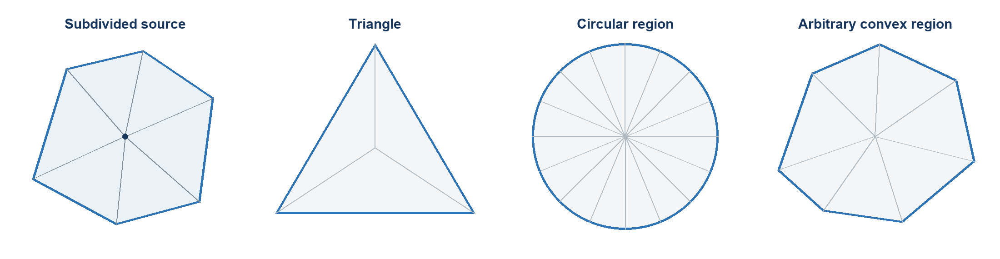
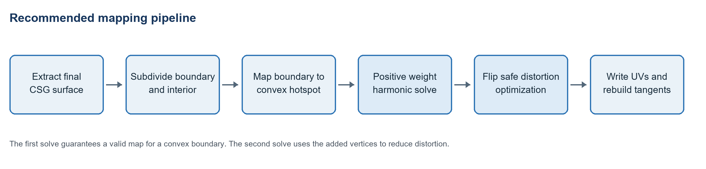

# Hotspot Texture Mapping in Chisel

_Research findings and implementation design_

**Recommendation**  Implement hotspot mapping as generated render geometry with piecewise affine UVs. Use an injective convex parameterization as the reliable base case, adaptive subdivision and flip-safe optimization for low distortion, and automatic cuts for nonconvex regions and holes. Treat border and interior mappings as separate but optionally continuous domains. Keep ordinary UVMatrix mapping as the fast path and as the state restored when hotspot mapping is removed.

| **Requirement** | **Recommended treatment** | **Result** |
| --- | --- | --- |
| Any convex hotspot | Sample its boundary, preserve cyclic order, and solve a convex combination map | No flipped triangles in the initialization |
| Low distortion | Refine high distortion triangles and optimize a scale normalized isometric energy | Distortion is distributed instead of concentrated |
| Triangles and circles | Use the same boundary sampler and solver | No shape specific UV algorithm is required |
| Current Chisel surfaces | Keep UVMatrix for affine placements and add a generated per vertex path | Existing content remains compatible |

## Scope and terminology

A hotspot target is a named, nonoverlapping region of a material texture. The hotspot layout is a planar subdivision: an author splits the source texture surface into pieces, and each enabled remaining piece is a selectable target. Targets may be convex, concave, curved through polygonal approximation, or contain holes. A mapping operation selects one target, orients the surface, establishes per-surface texel density, and generates the render geometry and UVs needed to use it.

The source is a planar Chisel output surface or a manually connected group of surfaces. Its visible CSG result may be clipped, split into components, or contain holes. Convex targets receive a validity-guaranteed initializer. Nonconvex and holed targets use automatic seams and subdivision before the same local distortion machinery is applied. Curves are always represented by polygonal subdivision because the generated mesh contains no analytic circles or splines.

## Findings from production hotspot tools

Public implementations converge on a common workflow: generate or reuse UV islands, classify and orient them, match them to atlas regions, fit or fill the chosen region, and expose a density or stretch tolerance. Their matching stages are useful precedent, but most stop at bounding boxes and affine island transforms.

| **Tool or workflow** | **Techniques exposed** | **Implication for Chisel** |
| --- | --- | --- |
| Valve derived hotspot workflows | Automatic matching of faces or islands to authored atlas regions | Treat the atlas layout as authored data, not inferred anew on every mesh |
| Zen UV | Aspect and area priorities, world or axis orientation, radial detection, tags, deterministic variation | Separate candidate filtering, orientation, matching, and placement |
| Houdini Labs Automatic Trim Texture | UV generation, shell rectification, seam angle, area preference, texel density error limit, reserved and tileable trims | Expose quality thresholds and explain rejected matches |
| HotspotUV | Fit, fill, seamless axes, maximum stretch, density preservation, radial tags, ID texture region detection | Offer fit and conform policies per hotspot rather than one global behavior |
| UModeler | Rectangular and triangular layouts, pixel padding, auto update, grouping of adjacent polygons | Triangle support and live regeneration are proven editor interactions |
| Maya Map Border | Square or circular boundary targets with a preserve original shape tradeoff followed by relaxation | Boundary placement and interior relaxation should be separate controls |

**The useful extension beyond these tools is to score the actual mapping distortion.** Bounding box aspect and area are inexpensive filters, but a convex hotspot solver can evaluate the best few candidates directly and select the region and boundary correspondence with the lowest measured stretch.

## Mapping model for every convex shape

A subdivided source surface and its UV image share one triangulation. Every triangle maps affinely, while the complete surface map is piecewise affine. More triangles do not remove unavoidable global distortion, but they allow the map to vary spatially and prevent a single affine transform from forcing the same shear across the whole surface.

*Figure 1  One subdivided source can use the same mapping algorithm for each convex target*

### Validity guarantee for convex targets

Floater's convex combination result gives the key safety property. If the source is a triangulated disk, its boundary maps homeomorphically and in cyclic order to a convex polygon, and every interior UV vertex is a positive weighted average of its neighbors, the piecewise linear map is one to one. In practical terms, the initial UV map has no inverted triangles. A sampled circle is a convex polygon for this purpose.

The implementation should therefore use positive weights for initialization. Uniform Tutte weights are the simplest and most conservative. Mean value weights normally give a better shape but require careful treatment of degenerate one rings. Cotangent weights should not be used for the guaranteed initialization because obtuse triangles can produce negative weights.

### Boundary correspondence

Boundary placement determines much of the final distortion. The baseline maps normalized cumulative source perimeter to normalized target perimeter. It preserves boundary edge length ratios and works for any sampled convex outline. A production implementation should improve that baseline in three ways.

- Detect significant source and target corners from turning angle and allow compatible corners to anchor to one another.

- Test cyclic offsets, permitted rotations, and optional reflection. A circle has no privileged corner, so orientation can come from world up, the longest source axis, or a deterministic seed.

- After initialization, allow unpinned boundary samples to slide along their target edge or curve while preserving strict cyclic order.

### Subdivision strategy

Subdivision should be driven by boundary accuracy and mapping error rather than by a fixed grid. The surface is planar, so added vertices do not change its shape. They only give the UV solution more freedom.

1. Insert source boundary vertices wherever a target corner must receive an exact correspondence.

1. Sample curved target boundaries until their maximum chord error is below a configurable fraction of a texel, such as 0.25 pixel at the atlas resolution.

1. Create a constrained triangulation of the source boundary, adding interior Steiner vertices according to world area or maximum edge length.

1. Solve the initial mapping and measure every triangle's singular value ratio, density error, and signed UV area.

1. Split triangles whose distortion exceeds the threshold, retriangulate locally, and solve again. Stop at the error target or a vertex budget.

Longest edge bisection is easy to make conforming. Constrained Delaunay refinement generally produces better triangle quality and therefore better conditioned solves. Boundary refinement should precede interior refinement so the target outline is already stable when distortion is evaluated.

### Low distortion optimization

The positive weight harmonic result is a validity initializer, not the final quality target. Harmonic maps can concentrate area or shear near corners. Optimize the initialized UVs with an energy that penalizes both expansion and compression relative to the desired texel density and becomes singular as a triangle approaches inversion.

| **Method** | **Strength** | **Limitation** | **Recommended role** |
| --- | --- | --- | --- |
| Uniform Tutte | Simple positive weights and convex target validity | Often high distortion | Guaranteed initialization and fallback |
| Mean value harmonic | Positive local weights and improved shape in many meshes | Still boundary sensitive | Preferred initialization after numerical safeguards |
| LSCM | Low angular distortion and a linear solve | Free boundary formulation does not by itself fill an authored hotspot | Candidate scoring or unconstrained preprocess |
| ABF++ | Low angle distortion with valid parameterizations | More implementation complexity than needed for planar brush faces | Reference technique, not first implementation |
| ARAP | Preserves local triangle shape | Needs a valid initialization and can require safeguards | Interactive quality refinement |
| SLIM with symmetric Dirichlet | Flip preventing optimization of isometric or conformal energies | Repeated sparse solves and local matrix operations | Highest quality conform mode |
| Optimal mass transport | Strong area preservation | Substantially more machinery and can trade angle quality for area | Optional future density equalization |

For Chisel's planar faces, a scale normalized symmetric Dirichlet objective is a good default. Evaluate the two singular values of each triangle's source to UV Jacobian after dividing by the desired UV scale. Penalize values above and below one symmetrically, weight by source area, and reject any step whose signed UV area is not positive. The same measurements can drive the adaptive subdivision loop and the editor heatmap.

## Shape specific behavior

### Triangles

A source triangle can fill a triangular hotspot with one affine transform, but the result is distortion free only when both triangles are similar. Subdivision permits a nontriangular source to use a triangular region and lets the optimizer distribute compression near the three target corners. Try every compatible source corner assignment and keep the lowest energy result.

### Circles and ellipses

Sample the target curve by arc length and by curvature. A circle needs uniform angular samples; an ellipse needs arc length sampling rather than uniform parameter angle if boundary edge lengths are to remain balanced. Continue subdivision until the polygonal outline falls within the pixel padding tolerance. The convex mapping guarantee then applies to the sampled polygon.

### Arbitrary convex polygons and curves

Validate authored polygons by consistent orientation, nonintersection, and nonoverlap with other targets. Convex Bezier or spline-like outlines are stored as polygonal approximations. Apply the border inset in atlas pixel space so its visible thickness is uniform around rectangular and nonrectangular regions. If the requested inset cannot fit, reduce it until the inset remains valid rather than rejecting the target.

## Surface topology cases

| **Source topology** | **Handling** |
| --- | --- |
| One connected component with one boundary | Map directly as a triangulated disk. |
| Several disconnected components | Map as separate charts within the same selected hotspot target and optimize their placement together. |
| A component with holes | Choose automatic cuts, duplicate render vertices along them, and solve the resulting disk-like charts. |
| Nonmanifold boundary | Split into the most useful manifold charts that can be recovered, return a best-effort mapping, and identify the repaired or omitted edges in diagnostics. |
| Degenerate or near zero area triangles | Exclude or locally repair them before solving and report the affected region; never include them in the distortion metric. |

Mapping a surface with a hole onto a filled disk cannot be bijective without changing topology. Chisel therefore chooses one or more cuts automatically, duplicates render vertices along those cuts, and solves the resulting disk-like charts. The cut objective should balance cut length, UV distortion, texture discontinuity, and declared surface-connection priorities. Nonconvex targets use the same principle when a single injective chart cannot satisfy the target boundary.

## Candidate matching beyond rectangles

Current hotspot tools commonly rank bounding box aspect, area, orientation, radial character, tags, and texel density. Those features remain useful as a fast first pass. For arbitrary convex regions, use a two stage search.

1. Filter by material, semantic tag, topology, permitted orientation, density range, and region capacity.

1. Rank the survivors using area ratio, compactness, oriented extent ratio, convexity, and a sampled turning angle signature.

1. Run a coarse harmonic map for the best few regions and boundary correspondences.

1. Choose the candidate with the lowest measured distortion after applying coverage and density penalties.

This avoids inventing a shape descriptor that must predict the behavior of the final solver. The solver itself is the most accurate matcher once inexpensive filters have reduced the candidate count. Cache results by source boundary hash, hotspot revision, mapping settings, and desired density.

## Recommended Chisel implementation

*Figure 2  Recommended processing order for conforming hotspot maps*

### Current constraints

Chisel currently stores one affine UVMatrix per surface and evaluates it immediately before tangent generation. This remains the fast path for ordinary mapping and simple hotspot placements. A piecewise affine warp needs generated per-vertex UVs and may need additional render vertices at subdivision, atlas-wrap, and chart seams. The current shared render, collider, and selection streams must therefore be refactored so hotspot subdivision changes only the render mesh.

Hotspot subdivision must not alter editable brush topology, collider geometry, or selection geometry. New vertices and indices are generated output only. The render stream may duplicate positions at UV discontinuities while collider and selection streams keep their existing topology. Surface ownership metadata must remain available on every generated render triangle for picking, diagnostics, and incremental rebuilds.

### Data model

The implementation needs stable target identifiers; target topology and border metadata; per-surface target selection, texel density, rotation, translation, mirroring, and border overrides; ordered edge-connection records; quality and subdivision limits; and enough state to restore the previous ordinary UVMatrix. Repeatable sections store repeat and partial-use permissions rather than a scale control.

Store the hotspot layout in an asset referenced by the material. The highest-resolution material texture defines the default pixel grid for borders, padding, and snapping, with an explicit resolution override when required. At build time, convert the layout into job-friendly immutable data. Stable identifiers prevent layout reordering from silently changing assigned targets.

### Core processing changes

1. After final CSG loops are triangulated and surface vertices are registered, reconstruct the connected surface components and boundary loops from the shared index list.

1. For hotspot surfaces, generate render-only subdivisions and duplicate render vertices at chart or wrapping seams. Do not change the brush, collider, or selection topology.

1. Generate target boundary samples from the effective border and interior outlines, establish cyclic correspondence for convex charts, and introduce automatic cuts where nonconvexity or holes require disk topology.

1. Run a Burst compatible iterative positive weight solve for interior UVs. Jacobi is easy to parallelize; red black Gauss Seidel converges faster if scheduling permits.

1. Optionally run a bounded number of local global distortion iterations. Preserve the valid initialization through line search and signed area checks.

1. Write UVs, collapse generated seams whose coordinates are continuous within tolerance, calculate tangents, and then pass the surface to decal processing so decals see the final render topology.

The conforming stage belongs before tangent calculation and decal clipping. The affine path continues to call the current matrix-based UV function without allocating solver state. Runtime generation may run asynchronously; the previous valid render mesh remains visible until the completed replacement swaps in atomically.

### Editor workflow

- Display the manually authored, nonoverlapping target subdivision over the atlas texture, including enabled pieces, holes, border insets, corner regions, and pixel padding.

- Choose a target automatically. Preserve the current target after geometry edits while it remains acceptable; otherwise rerun selection. When several candidates are good enough, let the user cycle through them with a Scene View overlay button or keyboard shortcut.

- Expose per-surface rotation, texel density, optional mirroring, and translation for repeatable mappings. Rotation is free with independent snapping aids. Initial orientation maps world up to texture up and is then stored in object-local terms so it rotates with the object.

- Provide a debug view for stretch, compression, anisotropy, UV discontinuity, automatic cuts, budget-limited areas, and unsatisfied edge connections. A best-effort result remains usable even when it exceeds the preferred quality range.

- Provide separate overlay toggles for texel, repeat-period, geometry-edge, and connected-surface snapping. Mirroring is a hotspot option and is off by default. Activating a hotspot material maps immediately; removing it restores the surface's previous ordinary UVMatrix.

## Implementation phases

| **Phase** | **Scope** | **Acceptance criteria** |
| --- | --- | --- |
| One | Layout asset, nonoverlapping polygonal targets, automatic selection, affine placement, per-surface density and rotation | Existing UV behavior remains unchanged; any convex target maps deterministically with pixel-aware padding |
| Two | Render-only subdivision, positive-weight initialization, optional borders, repeatable geometry, visual diagnostics | No inverted chart triangles; collider and selection topology remain unchanged |
| Three | Flip-safe refinement, adaptive subdivision, concave and holed targets with automatic cuts, async runtime generation | Best-effort output is stable under cancellation, budgets, and topology changes |
| Four | Manual surface connections, ordered continuity constraints, edge border overrides, complete generated visual suite | Connected groups update together and every named visual case can be traced to source |

## Testing and quality gates

- Property tests generate convex, concave, and holed target polygons and verify positive signed UV area within each chart, legal seam duplication, deterministic output, and boundary containment.

- Golden structural cases cover triangles, regular and irregular polygons, sampled circles and ellipses, strongly elongated regions, concave regions, holes, multiple components, and connected noncoplanar surfaces.

- Border tests verify uniform pixel inset, automatic thickness reduction, derived corner regions, optional borders, connected-edge suppression and overrides, repeat counts, stretch allowances, partial use, pixel alignment, and seam welding when UVs are continuous.

- Interior tests verify balanced distortion, texel density, rotation, mirroring, repeatable translation, progressively larger candidate selection, and emergency repetition only after no larger target is available.

- Connection tests cover create and disconnect operations, newest-connection priority, cross-edge continuity, material propagation, breaking incompatible destination connections, temporary edge disappearance, and automatic reactivation when the logical shared edge returns.

- Editor and runtime tests verify async cancellation and replacement, retention of the previous valid render mesh, render-only subdivision, restoration of the previous UVMatrix, deterministic rebuild hashes, and best-effort output at quality or vertex limits.

## Resolved product design

| **Decision** | **Recommendation** | **Reason** |
| --- | --- | --- |
| Supported targets | Any nonoverlapping polygonal target, including convex, concave, and holed regions | Convex targets use a guaranteed initializer; complex topology is handled with automatic cuts and best-effort charts |
| Mapping objective | Balance target coverage, texel density, angle distortion, and length distortion | One extreme is unsuitable for both pixel-art atlases and realistic materials |
| Subdivision | Generated render geometry only | UV flexibility must not modify brushes, colliders, or selection meshes |
| Borders | Optional uniform pixel inset with per-section stretch, repeat, and partial-use rules | Supports trim-like borders without imposing them on every texture |
| Connections | Manual shared-edge links with newest-first soft-constraint priority | Continuity is attempted across editable topology while conflicts remain explainable |

The following behavior is the working production specification. Quality thresholds and subdivision budgets begin as project defaults with optional per-hotspot overrides. Their numerical defaults should be tuned against production content rather than treated as permanent API guarantees.

### Hotspot layout and material data

A material may reference one hotspot layout asset. The hotspot editor divides the texture into nonoverlapping polygonal targets; each enabled remaining piece becomes a candidate target. Targets may contain holes. The layout stores each target outline once, along with optional border metadata, section rules, mirror permission, semantic tags, and resolution override. The highest-resolution texture otherwise supplies the pixel coordinate system.

| **Scope** | **Resolved behavior** |
| --- | --- |
| Target selection | Automatic. Prefer progressively larger compatible targets and score the best candidates using measured distortion, coverage, and density. Preserve a user-cycled choice while it remains acceptable. |
| Connected group | All connected surfaces share one hotspot target. Each surface keeps independent density, rotation, translation, mirror state, and border overrides. |
| Border | Optional per target and suppressible per surface edge. Thickness is a uniform pixel inset and shrinks until valid. Border and interior are separable, but a continuous shared seam is welded when their UVs agree. |
| Interior | Fit with balanced distortion by default. If the surface exceeds the largest compatible target at its requested density, repeat as an emergency fallback and report that choice. |
| Repeatable section | Repeat without a maximum count. Choose the fewest allowed repeats, then the least stretch. Use a partial final section only when that section permits partial use. |
| Orientation | Initialize texture up from world up. Store the result locally so it rotates with the object. Allow free rotation with snapping, optional mirroring, and translation for repeatable mappings. |

### Border and interior construction

The target border follows the target outline. Adjacent inset border strips intersect to create corner regions automatically; the user does not pair source corners to separate authored corner objects. Each border edge or corner section may specify permitted stretch, repetition, and partial use. The solver treats border and interior independently enough to honor those rules, then attempts to remove their shared seam when coordinates and derivatives are compatible. Integer pixel-edge alignment takes priority when it does not cause excessive distortion. Filtered textures use extruded gutters around discontinuous charts, while a truly continuous border-interior boundary needs no gutter.

Repeatability is implemented in geometry, not a shader. The system evaluates a continuous local UV transform, subdivides render triangles where integer repeat lines cross them, duplicates vertices at wrap seams, and remaps each tile into the authored atlas region. Border repetition is normally one-dimensional along the outline; interior repetition is two-dimensional. This produces the same control model as a texture with one UV matrix while keeping the final renderer shader-independent.

### Surface connections

In UV editing mode, the user creates a connection by dragging from one surface across a shared edge to the neighboring surface. A disconnect command removes it. The relation is stored against the authored logical edge. If later geometry temporarily removes the shared geometric edge, the relation remains serialized but is ignored; it becomes active again if that edge returns.

A connection regenerates both incident surfaces and attempts continuous UVs across the edge for hotspot and ordinary UVMatrix mapping. Connections are ordered soft constraints: later connections have priority when a cycle or incompatible set cannot be satisfied. Internal borders are omitted by default but can be enabled or disabled manually per connected edge. Enabling a border does not by itself authorize a UV seam.

Connecting to a destination assigns the source hotspot material to that destination immediately. If the destination used a different hotspot material, its existing hotspot connections break before the new connection is established. The resulting connected group selects one target and updates as a unit.

| **Constraint** | **Priority and fallback** |
| --- | --- |
| Newly declared connection | Protect before older connections. Distort other regions or leave an older edge discontinuous first. |
| UV continuity | Avoid seams where feasible. Collapse a generated seam when UV coordinates are continuous within the selected texel tolerance. |
| Pixel alignment | Snap boundaries and repeat lines to integer texel edges when the added distortion stays acceptable. |
| Border fit | Reduce effective pixel thickness until every required strip and corner remains valid. |
| Target capacity | Try larger compatible targets. Only after the largest target fails may a nonrepeatable interior repeat as a best-effort fallback. |
| Quality or budget limit | Return the best valid mapping, retain diagnostics, and never produce inverted triangles merely to fill the target. |

### Generated geometry and runtime behavior

Hotspot subdivision exists only in the generated render mesh. It does not modify brush topology and does not add collider or selection triangles. Runtime and editor builds use the same deterministic mapping inputs. Runtime work may execute asynchronously; the currently valid mesh stays active until a complete replacement is ready, then the renderer swaps it atomically. Cancellation and revision checks prevent stale jobs from replacing newer edits.

### Diagnostics and editing controls

A Scene View overlay exposes target cycling, free rotation, and independent toggles for texel, repeat-period, geometry-edge, and connected-surface snapping. The diagnostic mode visualizes local stretch and compression, anisotropy, UV seams, automatic cuts, border reduction, emergency repetition, and any connection that was relaxed or left discontinuous. The display should identify the logical edge and its connection priority so the user can act on the result.

### Automated and visual verification

Automated tests are numerical and structural rather than image-comparison tests. Parameterized fixtures should cover the cross-product of surface topology, target topology, border state, border-section behavior, interior behavior, transformations, connection state, quality limits, editor generation, and asynchronous runtime generation. Pairwise generation can control routine test volume, while explicitly enumerated interaction tests cover high-risk combinations such as holed targets with connected surfaces and repeating borders.

| **Test dimension** | **Required values** |
| --- | --- |
| Surface topology | Triangle; convex polygon; concave polygon; sampled curved outline; holes; disconnected components; clipped CSG result |
| Target topology | Convex; concave; polygonal circle or ellipse; holes; disabled neighboring pieces |
| Border | Absent; present; auto-reduced; connected-edge suppressed; manually forced; continuous weld; discontinuous seam |
| Section rules | Rigid; stretch-limited; repeatable; partial-use allowed; partial-use forbidden; corner and edge combinations |
| Interior | Balanced fit; explicitly repeatable; emergency repetition; pixel-aligned; mirrored and unmirrored |
| Connections | None; chain; loop; conflicting priorities; material replacement; disappearing and restored shared edge |
| Execution | Editor synchronous request; asynchronous runtime completion; cancellation; stale-result rejection; previous-mesh retention |

A Unity Editor test menu generates the visual inspection suite into a fixed HotspotVisualTests directory beside the Assets directory. Before generation it validates that exact project-relative destination and clears only its contents. The folder remains outside Assets and is not configurable because it is test output. Each case has a stable globally unique source identifier; the same identifier appears in the test definition and generated filename so a reviewer can search the code directly from an image name. The suite generates all cases without pixel-diff assertions and is intended for human inspection.

### Initial production tuning

Begin with project-wide quality and subdivision defaults plus optional per-hotspot overrides. Record mapping energy, maximum singular-value ratio, generated vertex count, solve time, seam count, repeat count, and fallback reason. Production examples should determine the final defaults. These measurements are diagnostics and tuning inputs, not hard rejection criteria; the system returns the best valid result it can construct from the supplied geometry and hotspot rules.

## Sources

1. [Valve Developer Community  Half Life Alyx Hotspot Texturing](https://developer.valvesoftware.com/wiki/Half-Life%3A_Alyx_Workshop_Tools/Level_Design/Hotspot_Texturing)

2. [Zen UV  Hotspot Mapping](https://zenmastersteam.github.io/Zen-UV/latest/trimsheet_hotspot/)

3. [SideFX  Labs Automatic Trim Texture](https://www.sidefx.com/docs/houdini/nodes/sop/labs--automatic_trim_texture.html)

4. [HotspotUV  Trim Sheet UV Mapping](https://3designdk.com/)

5. [UModeler  Hotspot Texturing](https://umodeler.github.io/HotspotTexturing.html)

6. [Autodesk Maya  Map Border Options](https://help.autodesk.com/cloudhelp/2027/ENU/Maya-Modeling/files/GUID-48B62524-F400-466F-8D8C-0CF888A23F93.htm)

7. [Floater  One to one Piecewise Linear Mappings over Triangulations](https://citeseerx.ist.psu.edu/document?doi=7dc5adef0215539e389ae670027fe8195b4c82fd&repid=rep1&type=pdf)

8. [CGAL  Planar Parameterization of Triangulated Surface Meshes](https://doc.cgal.org/latest/Surface_mesh_parameterization/index.html)

9. [libigl  Parameterization Tutorial](https://libigl.github.io/tutorial/)

10. [Levy and others  Least Squares Conformal Maps](https://www.cs.jhu.edu/~misha/ReadingSeminar/Papers/Levy02.pdf)

11. [Sheffer and others  ABF++](https://www.cs.ubc.ca/~sheffa/papers/abf_plus_plus.pdf)

12. [Rabinovich and others  Scalable Locally Injective Mappings](https://igl.ethz.ch/projects/slim/)

13. [Hormann and Floater  Mean Value Coordinates for Arbitrary Planar Polygons](https://www.inf.usi.ch/hormann/papers/Hormann.2006.MVC.pdf)

14. [Sander and others  Texture Mapping Progressive Meshes](https://cs.harvard.edu/~sjg/papers/tmpm.pdf)

15. [Dominitz and Tannenbaum  Texture Mapping via Optimal Mass Transport](https://pmc.ncbi.nlm.nih.gov/articles/PMC2886313/)

## Relevant Chisel code

| **File** | **Relevance** |
| --- | --- |
| SurfaceDetails.cs | UV0 stores one 2 by 4 affine mapping per surface |
| UVMatrix.cs | The storage can hold arbitrary affine rows, while TRS and editor decomposition assume rotation and axis scale |
| GenerateSurfaceTrianglesJob.cs | Final surface triangulation, normal processing, UV generation, tangent generation, and decal processing meet here |
| MeshAlgorithms.cs | ComputeUVs applies one matrix to every render vertex |
| ChiselBrushRenderBuffer.cs | Collider, selection, and render streams currently share indices and must have identical vertex counts |
| SubMeshTriangleLookup.cs | Generated triangles retain surface and brush ownership for selection and inspection |
