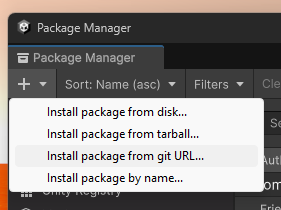
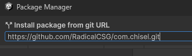

### Installation

Go to Window / Package Manager

In the package manager press the + and select "Install package from git URL"

---
In the textbox type in 

https://github.com/RadicalCSG/com.chisel.git

And press enter, this should install Chisel for you

---

Note that the first time you start up it might take some time due to Unity Burst compiling lots of code.
This should only happen once
