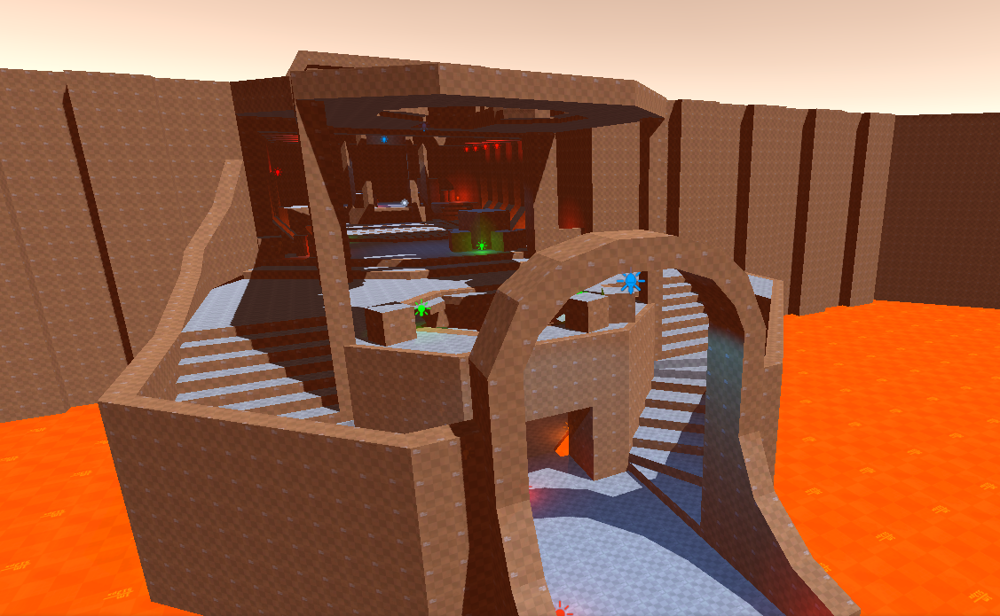

# [Chisel](https://github.com/RadicalCSG/Chisel) (WIP)

Chisel is an extension for **Unity** that allows for _rapid_, iterative, **non destructive** level editing!

---
* You can find [installation instructions here](INSTALLATION.md)
* [Click here for information on how to get started](GETTING_STARTED.md)
* Want to help out? [We have some good first issues here](https://github.com/RadicalCSG/Chisel/labels/good%20first%20issue)
*  If you have questions be sure to ask in the discord! **[Click here for to join the official Discord server!](https://discord.gg/zttNkPQ)**

---

Note:
- Chisel *requires Unity 6 or newer*
- UX is *still under development*
- CSG algorithm is *still under development*
- It is *not yet* ready for production, but please feel free to try it out, or better yet, help out!

---

Features (incomplete)
* [Constructive Solid Geometry Algorithm](http://www.youtube.com/watch?v=Iqmg4gblreo) that generates geometry in real-time
* Add and remove geometry to your level using CSG allows for fluid, interactive, non destructive workflows
* Higher level "generators" that create more complicated geometry to perform CSG with, while retaining context of what it is you're creating (if you create stairs, these will remain stairs that you can edit and tweak)
* Hierarchical Constructive Solid Geometry, allows for generators and brushes to be act as if they're one whole (composite), to perform CSG on other objects with
* Works well with prefabs, drag and drop windows onto walls including their holes
* Draw 2D shapes (possible to turn straight lines into curves) on existing CSG surfaces and extrude them
* Precise snapping to surfaces, edges, vertices and grid lines
* Rotatable & movable grid
* Subtractive Workflow **(NEW)**
* Normal smoothing **(NEW)**

Planned Features (incomplete, and in random order):
* [Debug Visualizations](https://github.com/RadicalCSG/Chisel.Prototype/issues/118) to see shadow only surfaces, collider surfaces etc.  (partially implemented)
* [Double sided surfaces](https://github.com/RadicalCSG/Chisel.Prototype/issues/226)
* [Extrusion from existing surface](https://github.com/RadicalCSG/Chisel.Prototype/issues/19)
* [Clip Tool](https://github.com/RadicalCSG/Chisel.Prototype/issues/15)
* [Node Based Generators](https://github.com/RadicalCSG/Chisel.Prototype/issues/94) for easy procedural content generation
* [2D shape editor](https://github.com/RadicalCSG/Chisel.Prototype/issues/260)
* [Hotspot mapping](https://github.com/RadicalCSG/Chisel.Prototype/issues/173)
* [Sub-Models](https://github.com/RadicalCSG/Chisel.Prototype/issues/259)
* [Trim Decals](https://github.com/RadicalCSG/Chisel.Prototype/issues/117)
* [Grid Objects](https://github.com/RadicalCSG/Chisel.Prototype/issues/121)

---
Extensions:
* [Source Engine 2006 Map Importer for Chisel Editor]( https://github.com/Henry00IS/Chisel.Import.Source)
  * [Decal support for importer](https://github.com/Henry00IS/Chisel.Decals)
  * [VPK import support for importer](https://github.com/nukeandbeans/com.chisel.import.source.vpktools)
* [Quake1 Importer](https://github.com/Quixotic7/Chisel.Import.Quake1)

If you find any failure cases, if possible please provide us with a reproducible scene so we can more easily fix it!

---
The core technology is based on the algorithm explained in [this GDC 2020 talk](http://www.youtube.com/watch?v=Iqmg4gblreo)

